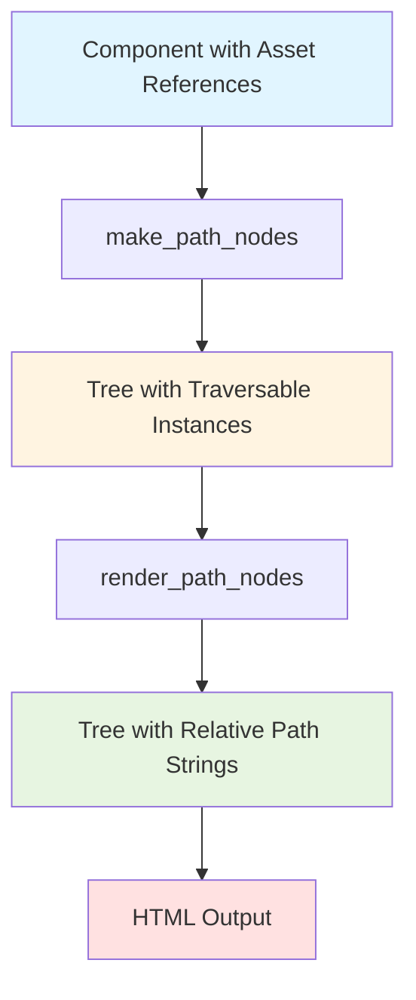
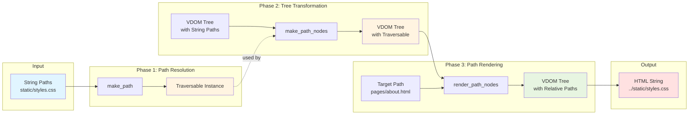
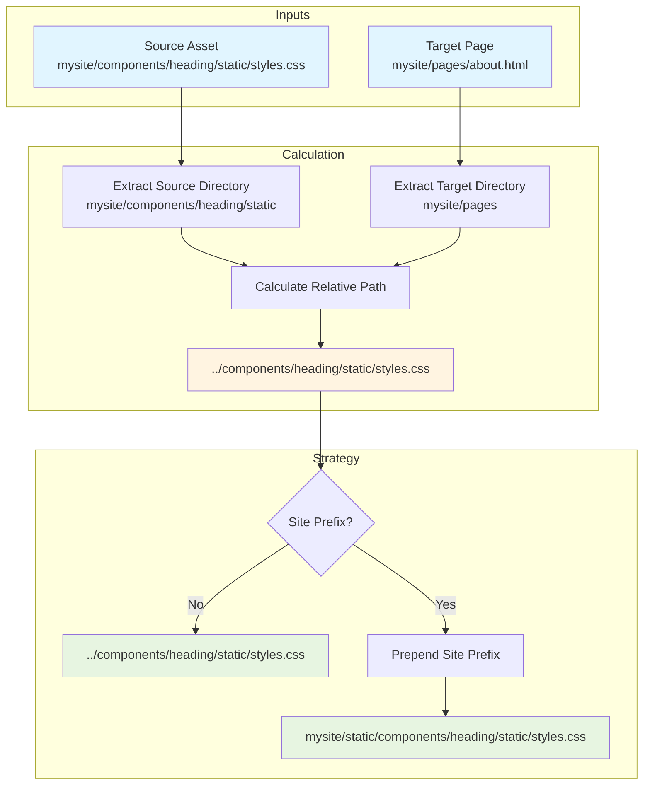

# Core Concepts

This guide explains the fundamental concepts of tdom-path and how the three core functions work together to provide component asset path resolution for web applications.

## Overview

tdom-path provides a three-phase pipeline for resolving component assets:

1. **Path Resolution** - Convert asset references to Traversable instances
2. **Tree Transformation** - Automatically rewrite VDOM trees to use Traversable
3. **Path Rendering** - Convert Traversable to relative path strings for HTML output

## The Three Core Functions

### make_path() - Path Resolution

`make_path()` creates Traversable instances from asset path strings. It supports two path formats:

**Package Paths** (format: `package:resource/path`):
```python
>>> from tdom_path import make_path
>>> # Reference asset from installed package
>>> css_path = make_path(None, "bootstrap:dist/css/bootstrap.css")  # doctest: +SKIP
```

**Relative Paths** (format: `resource/path`, `./resource/path`, or `../resource/path`):
```python
>>> from mysite.components.heading import Heading
>>> # Reference asset relative to component's module
>>> css_path = make_path(Heading, "static/styles.css")
```

Path type detection is automatic based on the presence of a colon (`:`) character.

### make_path_nodes() - Tree Transformation

`make_path_nodes()` walks a VDOM tree and automatically transforms `<link href="...">` and `<script src="...">` elements to use Traversable instances:

```python
>>> from tdom import Element
>>> from tdom_path import make_path_nodes
>>> from mysite.components.heading import Heading
>>> # Original tree with string asset references
>>> tree = Element("head", children=[
...     Element("link", {"rel": "stylesheet", "href": "static/styles.css"}),
...     Element("script", {"src": "static/script.js"}),
... ])
>>> # Transform to use Traversable
>>> transformed = make_path_nodes(tree, Heading)
>>> # Link href and script src are now Traversable instances
```

External URLs (http://, https://), special schemes (mailto:, tel:), and anchor-only links (#...) are left unchanged.

### render_path_nodes() - Path Rendering

`render_path_nodes()` converts Traversable instances in a tree to relative path strings suitable for HTML output:

```python
>>> from pathlib import PurePosixPath
>>> from tdom_path import render_path_nodes
>>> from tdom_path.tree import RelativePathStrategy
>>> # Render for a specific target page
>>> target = PurePosixPath("mysite/pages/about.html")
>>> rendered = render_path_nodes(transformed, target)
>>> # Paths are now relative strings: "../components/heading/static/styles.css"
>>> # With site prefix for subdirectory deployment
>>> strategy = RelativePathStrategy(site_prefix=PurePosixPath("mysite/static"))
>>> rendered = render_path_nodes(transformed, target, strategy=strategy)
```

## Path Rewriting Lifecycle

This diagram shows the complete lifecycle from component definition to rendered HTML:



## Function Relationships and Data Flow

This diagram illustrates how data flows between the three core functions:



## Relative Path Calculation Mechanism

This diagram explains how relative paths are calculated from the target output location to the source asset:



## Complete Pipeline Example

Here's a full example showing all three phases:

```python
>>> from pathlib import PurePosixPath
>>> from tdom import Element
>>> from tdom_path import make_path_nodes, render_path_nodes
>>> from tdom_path.tree import RelativePathStrategy
>>> from mysite.components.heading import Heading
>>> # Define component with mixed package and relative paths
>>> class PageHeading:
...     def __html__(self):
...         return Element("div", children=[
...             Element("head", children=[
...                 # Package path - references bootstrap package
...                 Element("link", {
...                     "rel": "stylesheet",
...                     "href": "bootstrap:dist/css/bootstrap.css"
...                 }),
...                 # Relative path - references local component asset
...                 Element("link", {
...                     "rel": "stylesheet",
...                     "href": "static/heading.css"
...                 }),
...                 Element("script", {"src": "static/heading.js"}),
...             ]),
...             Element("h1", children=["Welcome"]),
...         ])
>>> # Phase 1 & 2: Transform string paths to Traversable
>>> heading = PageHeading()
>>> tree = heading.__html__()
>>> path_tree = make_path_nodes(tree, Heading)  # doctest: +SKIP
>>> # Bootstrap link href: Traversable for bootstrap package
>>> # Heading link href: Traversable for component's static/heading.css
>>> # Script src: Traversable for component's static/heading.js
>>> # Phase 3: Render for specific target page (relative paths)
>>> target = PurePosixPath("mysite/pages/about.html")
>>> rendered_tree = render_path_nodes(path_tree, target)  # doctest: +SKIP
>>> # Paths are now relative strings calculated from target location
>>> # Convert to HTML string
>>> html_output = str(rendered_tree)  # doctest: +SKIP
```

## Decorator Pattern

For convenience, use the `@path_nodes` decorator to automatically apply `make_path_nodes()`:

```python
>>> from tdom_path import path_nodes  # doctest: +SKIP
>>> class MyHeading:  # doctest: +SKIP
...     @path_nodes  # doctest: +SKIP
...     def __html__(self):  # doctest: +SKIP
...         return Element("link", {"href": "static/styles.css"})  # doctest: +SKIP
>>> heading = MyHeading()  # doctest: +SKIP
>>> tree = heading.__html__()  # Already has Traversable instances  # doctest: +SKIP
```

## Key Design Principles

1. **Immutable Transformations** - All functions return new trees, never mutate originals
2. **Type Safety** - Comprehensive type hints enable IDE autocomplete and type checking
3. **Fail-Fast Validation** - Asset existence checked immediately with clear error messages
4. **External URL Detection** - External URLs and special schemes left unchanged
5. **Cross-Platform Consistency** - PurePosixPath ensures consistent web paths on all platforms
6. **Extensibility** - RenderStrategy Protocol allows custom rendering strategies

## Asset Validation

All assets are validated automatically during tree transformation:

```python
>>> # If asset doesn't exist, transformation fails immediately
>>> try:
...     tree = Element("link", {"href": "static/missing.css"})
...     make_path_nodes(tree, Heading)
... except FileNotFoundError as e:
...     # Clear error with component and attribute context
...     assert "missing.css" in str(e)
...     # "Asset not found: 'missing.css' (attribute: 'href', component: 'Heading'...)"
```

Validation ensures build-time detection of broken asset references, preventing runtime errors in production.

## Next Steps

- Explore [API Reference](../reference/api-reference.md) for detailed function documentation
- See [Cookbook Patterns](cookbook.md) for common use cases
  +++++++ REPLACE
