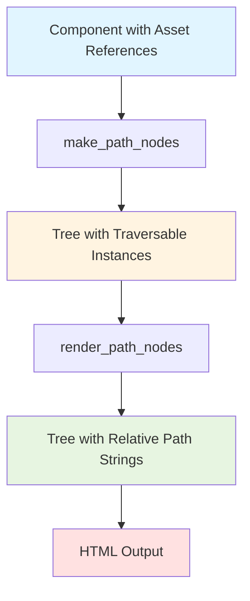
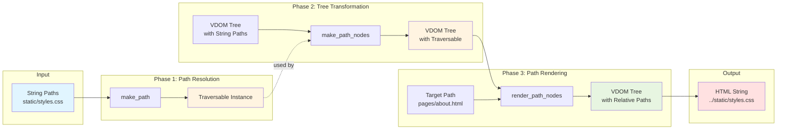

# tdom-path

Easily rewrite the static asset paths in your tdom-based markup. Works great for static-site generators.


```{include} ../README.md
:start-after: "## Installation"
:end-before: "## <!-- README-only --> Path Syntax Reference"
```

## Path Rewriting Lifecycle

The complete lifecycle from component to rendered HTML:



## Function Relationships

How data flows between the three core functions:



```{toctree}
:maxdepth: 2
:hidden:

guides/index
reference/index
```

## Next Steps

- Read [Core Concepts](guides/core-concepts.md) to understand the architecture
- Explore [Cookbook Patterns](guides/cookbook.md) for common use cases
- Check [API Reference](reference/api-reference.md) for detailed function documentation
- Learn about [Advanced Usage](guides/advanced.md) for custom strategies and extensions
