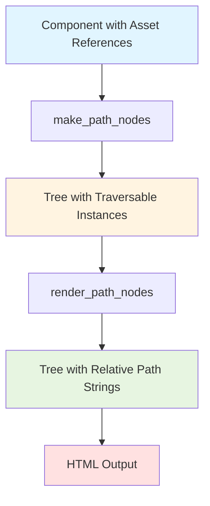
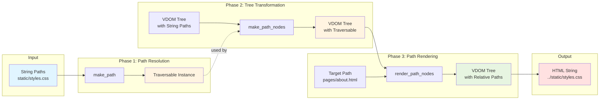

# tdom-path Documentation

Component resource path utilities for web applications using Traversable paths.

## Overview

`tdom-path` provides utilities for resolving component static assets (CSS, JS, images) in component-based web applications. It supports both package assets (using `package:path` syntax) and relative paths, returning `Traversable` objects that represent resource locations suitable for web rendering.

### Key Features

Derived from implemented features:

- **Package Asset Support** - Reference assets from installed packages using `package:path` syntax
- **Relative Path Rendering** - Calculate relative paths from target to source for HTML output
- **Framework Independence** - Same components work in Flask, Django, FastAPI, Sphinx
- **Type Safety** - Comprehensive type hints with IDE autocomplete support
- **Asset Validation** - Automatic fail-fast validation with clear error messages
- **SSG Integration** - Asset collection via `RelativePathStrategy.collected_assets`
- **Decorator Support** - `@path_nodes` for automatic tree transformation
- **Immutable Transformations** - Tree rewriting creates new nodes without mutation
- **External URL Detection** - Automatically skips http://, https://, mailto:, etc.
- **Cross-Platform Paths** - PurePosixPath ensures consistent web paths

## Installation

Using uv (recommended):
```bash
uv pip install tdom-path
```

Using pip:
```bash
pip install tdom-path
```

**Requirements:**
- Python 3.14+
- tdom >= 0.1.13

## Quick Start

### Basic Usage with Package Paths

```python
from tdom_path import make_path

# Reference asset from installed package
css_path = make_path(None, "bootstrap:dist/css/bootstrap.css")
print(css_path.is_file())  # True
```

### Component with Relative Paths

```python
from tdom import Element
from tdom_path import path_nodes
from mysite.components.heading import Heading

class Heading:
    @path_nodes
    def __html__(self) -> Element:
        return Element("head", children=[
            Element("link", {"href": "static/styles.css"}),
        ])

# Asset path automatically resolved
heading = Heading()
tree = heading.__html__()
```

### Complete Pipeline

```python
from pathlib import PurePosixPath
from tdom_path import make_path_nodes, render_path_nodes

# Transform and render
tree = heading.__html__()
path_tree = make_path_nodes(tree, heading)

target = PurePosixPath("pages/about.html")
rendered = render_path_nodes(path_tree, target)

html = str(rendered)
```

## Documentation Sections

```{toctree}
:maxdepth: 2
:caption: Guides

guides/core-concepts
guides/cookbook
guides/framework-integration
guides/advanced
guides/performance
```

```{toctree}
:maxdepth: 2
:caption: Reference

reference/api-reference
reference/specifications
```

## Path Rewriting Lifecycle

The complete lifecycle from component to rendered HTML:



## Function Relationships

How data flows between the three core functions:



## Example Projects

Complete working examples for different frameworks:

- [Flask Example](../examples/flask-example/) - Dynamic server with component rendering
- Django Example - Template integration with Django views (see examples directory)
- FastAPI Example - Async routes with component rendering (see examples directory)
- Sphinx Example - SSG build with asset collection (see examples directory)

## Next Steps

- Read [Core Concepts](guides/core-concepts.md) to understand the architecture
- Explore [Cookbook Patterns](guides/cookbook.md) for common use cases
- Review [Framework Integration](guides/framework-integration.md) for specific frameworks
- Check [API Reference](reference/api-reference.md) for detailed function documentation

## Requirements

- Python 3.14+
- tdom >= 0.1.13

## Contributing

Contributions are welcome! Please see the project repository for contribution guidelines.

## License

[License information will be added]
