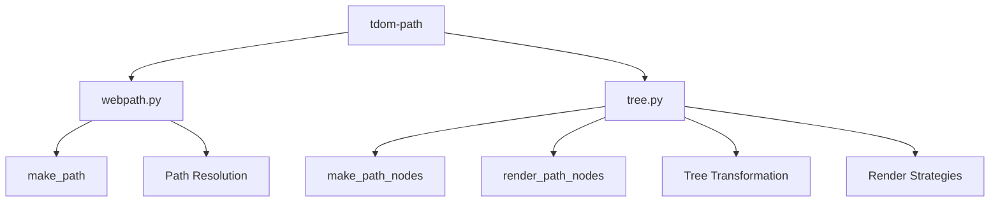

# Technical Specifications

This document provides detailed technical specifications for tdom-path.

## Architecture Overview

### Component Diagram



### Core Components

1. **Path Resolution Module** (`webpath.py`)
   - `make_path()`: Core path resolution function
   - Path type detection (package vs relative)
   - Package path parsing and resolution
   - Module-relative path calculation

2. **Tree Transformation Module** (`tree.py`)
   - `make_path_nodes()`: Tree rewriting with Traversable
   - `render_path_nodes()`: Final rendering with string paths
   - `@path_nodes` decorator: Automatic transformation
   - Tree walking and traversal utilities

3. **Data Structures**
   - `TraversableElement`: Element with Traversable attributes
   - `AssetReference`: Asset metadata for build tools
   - `RenderStrategy` protocol: Extensible rendering interface

## Performance Specifications

### Target Performance Metrics

| Operation | Target Time | Target Throughput | Memory Budget |
|-----------|-------------|-------------------|---------------|
| `make_path()` | < 50 μs | > 20,000 ops/s | < 100 KB |
| `make_path_nodes()` | < 5 ms (100 components) | > 200 ops/s | < 10 MB |
| `render_path_nodes()` | < 2 ms (100 components) | > 500 ops/s | < 5 MB |
| `_walk_tree()` | < 1 ms (100 components) | > 1,000 ops/s | < 1 MB |

### Scalability Requirements

- **Component Count**: Linear scaling up to 10,000 components
- **Tree Depth**: Support for 20+ levels of nesting
- **Concurrency**: Thread-safe operations for parallel processing
- **Memory**: Efficient memory usage for large component trees

## API Contracts

### Function Signatures

```python
def make_path(component: Any, asset: str) -> Traversable: ...
def make_path_nodes(target: Node, component: Any) -> Node: ...
def render_path_nodes(tree: Node, target: PurePosixPath, strategy: RenderStrategy | None = None) -> Node: ...
def path_nodes(func_or_method: Callable[P, R]) -> Callable[P, R]: ...
```

### Error Handling

- **FileNotFoundError**: Raised when assets don't exist
- **TypeError**: Raised for invalid component types
- **ModuleNotFoundError**: Raised for missing packages
- **ImportError**: Raised for package import issues

### Type Safety

- Comprehensive type hints using PEP 604 syntax
- IDE autocomplete support
- Static type checking with `ty`
- Runtime type validation where appropriate

## Path Resolution Specifications

### Package Path Format

```
package:resource/path
```

- **Package**: Python package name (dotted names supported)
- **Resource Path**: Path within package resources
- **Separator**: Colon (`:`) character
- **Examples**: `mypackage:static/styles.css`, `my.package:images/logo.png`

### Relative Path Formats

1. **Plain**: `static/styles.css`
2. **Explicit Current**: `./static/styles.css`
3. **Parent Directory**: `../shared/common.css`

### Path Detection Algorithm

```python
def _detect_path_type(asset: str) -> Literal["package", "relative"]:
    return "package" if ":" in asset else "relative"
```

## Tree Transformation Specifications

### Element Processing Rules

1. **`<link>` elements**: Transform `href` attributes
2. **`<script>` elements**: Transform `src` attributes
3. **External URLs**: Skip transformation (http://, https://, //)
4. **Special Schemes**: Skip transformation (mailto:, tel:, data:, javascript:)
5. **Anchor Links**: Skip transformation (#...)

### Transformation Pipeline


### Immutable Transformation

- Original tree is never modified
- New nodes are created for transformations
- Memory-efficient for large trees
- Preserves original structure when no changes needed

## Rendering Strategy Interface

```python
class RenderStrategy(Protocol):
    def calculate_path(self, source: Traversable, target: PurePosixPath) -> str:
        """Calculate string representation for a path in rendered output."""
```

### Built-in Strategies

1. **RelativePathStrategy**: Relative path calculation
2. **Custom Strategies**: CDN URLs, absolute paths, etc.

## Build System Integration

### Asset Collection

- Collects `AssetReference` objects during rendering
- Provides metadata for build tools
- Supports copy operations to output directories

### Static Site Generation

- Integrates with SSG frameworks
- Provides optimized asset paths
- Supports site prefix deployment

## Testing Requirements

### Test Coverage

- **Unit Tests**: 100% coverage for core functions
- **Integration Tests**: End-to-end pipeline testing
- **Performance Tests**: Benchmark validation
- **Regression Tests**: Baseline comparison

### Test Infrastructure

- pytest-based test suite
- pytest-benchmark for performance testing
- pytest-freethreaded for concurrency testing
- ty type checker for type safety

## Compatibility Requirements

### Python Version

- Minimum: Python 3.14+
- Recommended: Python 3.14t (free-threaded)

### Dependency Requirements

- tdom >= 0.1.13
- pytest-benchmark >= 4.0.0
- pytest-freethreaded >= 0.1.0

### Platform Support

- Cross-platform (Windows, macOS, Linux)
- Traversable ensures consistent behavior
- Tested on CI/CD pipelines

## Security Considerations

### Path Validation

- Fail-fast on missing assets
- Clear error messages with context
- No silent failures

### Resource Access

- Uses `importlib.resources` for package access
- Read-only operations
- No arbitrary file system access

## Future Roadmap

### Planned Features

1. **Batch Mode Validation**: Collect all missing assets
2. **Strict/Lenient Modes**: Configurable validation
3. **Warning Mode**: Non-blocking validation
4. **Custom Strategies**: More built-in rendering options

### Performance Optimizations

1. **Caching**: LRU caching for frequent paths
2. **Parallel Processing**: Multi-threaded tree transformation
3. **Memory Optimization**: Reduced memory footprint

### Documentation Enhancements

1. **Interactive Examples**: Live code examples
2. **API Reference**: Auto-generated from docstrings
3. **Performance Dashboard**: Visual benchmark results

These specifications provide a comprehensive technical foundation for tdom-path development and usage.
